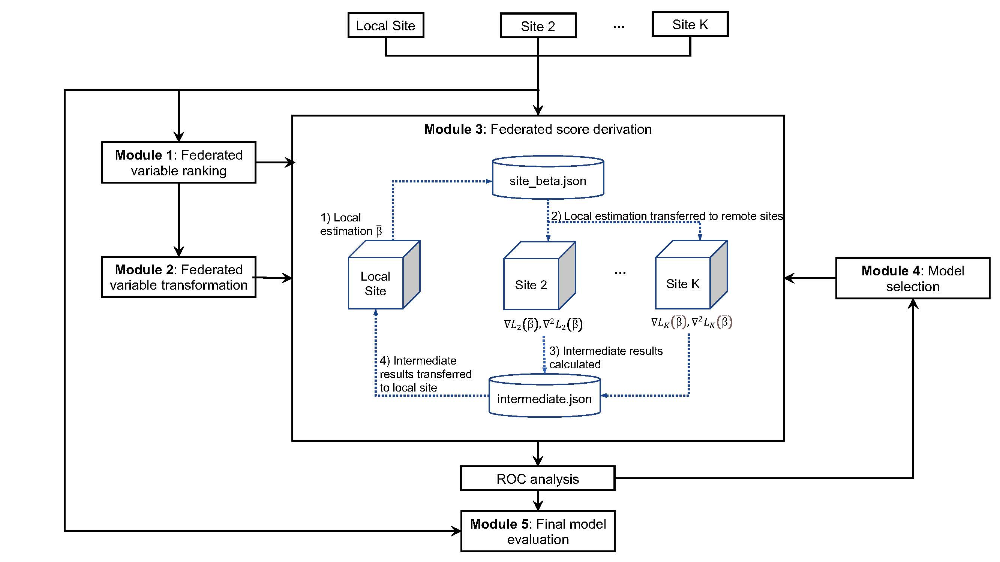

# FedScore: A privacy-preserving framework for federated scoring system development

FedScore is a framework for developing scoring systems across multiple sites in a privacy-preserving way. The R and Python code provided in this repository implements the proposed FedScore algorithm.

Discover the full story in the FedScore [paper](https://doi.org/10.1016/j.jbi.2023.104485) for binary outcomes, and explore our latest [preprint](https://arxiv.org/abs/2403.05229) where we extend FedScore to include survival outcomes.

## Introduction

Cross-institutional collaboration has gained popularity in recent years as a way to accelerate medical research and facilitate quality improvement. Federated learning (FL) can avoid data sharing by collectively training algorithms without exchanging patient-level data. However, most FL applications in medical image data use black box models from computer vision. Interpretable models, on the contrary, have fewer instances of FL applications despite their popularity in clinical research.

As a type of interpretable risk scoring model, scoring systems have been employed in practically every diagnostic area of medicine. However, scoring systems have usually been created using single-source data, limiting application at other sites if the development data has insufficient sample size or is not representative. Although it is possible to develop scoring systems on pooled data, the process of doing such pooling is time-consuming and difficult to achieve due to privacy restrictions. 

To fill this gap, we propose FedScore, a first-of-its-kind framework for building federated scoring systems across multiple sites. 

The figure below provides a high-level overview of the FedScore algorithm:

## Versions

FedScore is available in two programming languages, each catering to different FL frameworks (engineering-based & statistics-based). For a comprehensive overview, refer to the [review paper](https://doi.org/10.1093/jamia/ocad170) and [benchmarking study](https://arxiv.org/pdf/2311.03417.pdf).

### R Version (This Repository)
- **Programming Language:** R
- **FL Algorithms (Model-Specific):** [ODAL2](https://doi.org/10.1093/jamia/ocz199), [dCLR](https://www.nature.com/articles/s41746-022-00615-8), [ODAC](https://doi.org/10.1093/jamia/ocaa044) & [ODACH](https://www.nature.com/articles/s41598-022-09069-0)
- **FL Framework Type:** Statistics-Based
- **Communication Efficiency:** One-shot
- __Types of outcomes supported:__ Binary and survival outcomes
### Python Version ([FedScore-Python Repository](https://github.com/nliulab/FedScore-Python))
- **Programming Language:** Python
- **FL Algorithms (Model-Agnostic):** [FedAvg](https://proceedings.mlr.press/v54/mcmahan17a/mcmahan17a.pdf) etc. (Availability consistent with the [Flower](https://flower.ai/) framework)
- **FL Framework Type:** Engineering-Based
- **Communication Efficiency:** Requires multiple rounds of communications
- __Types of outcomes supported:__ Binary outcomes only

In summary, choose the version based on your preferences and refer to the respective repositories for detailed documentation and implementation details.

## Usage

### System requirements

To run the R and Python code, you will need:

- R packages: `AutoScore`, `tidyverse`, `ggplot2`, `mle.tools`, `rjson`, `doParallel`, `foreach`, `dplyr`, `survival`, `data.table`, `pda`, `survAUC`, `rstudioapi`
- Python packages: `sys`

### Running the demo

To run the demo scripts, follow the step-by-step instructions provided in `examples`. We have provided a demo for homogeneous data with binary outcomes and two demos for homogeneous and heterogeneous data with survival outcomes.

## Citation

Li, S., Ning, Y., Ong, M.E., Chakraborty, B., Hong, C., Xie, F., ... & Liu, N. (2023). FedScore: A privacy-preserving framework for federated scoring system development. Journal of Biomedical Informatics, 2023,104485, ISSN 1532-0464 https://doi.org/10.1016/j.jbi.2023.104485

## Contact

- Siqi Li (Email: <siqili@u.duke.nus.edu>)

- Nan Liu (Email: <liu.nan@duke-nus.edu.sg>)
